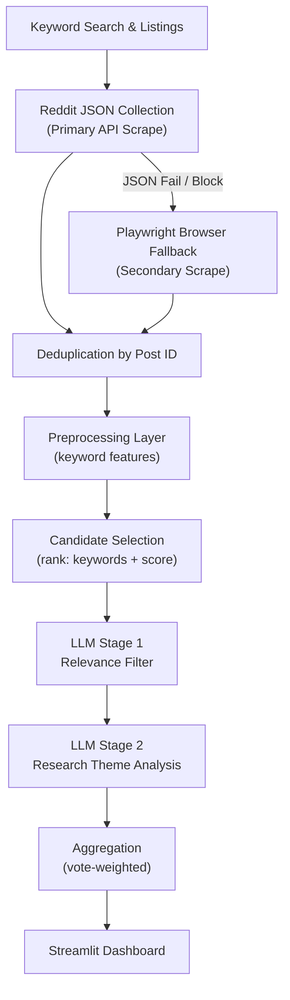
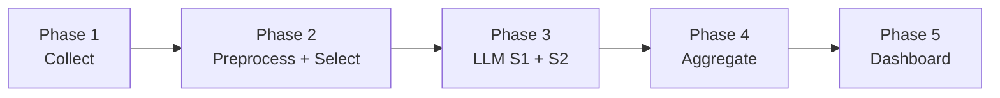
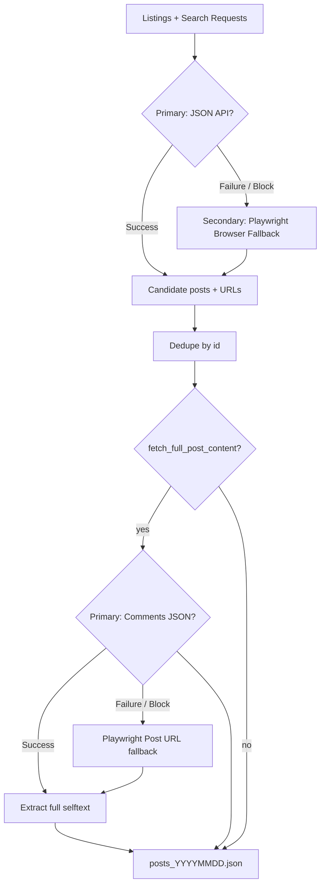
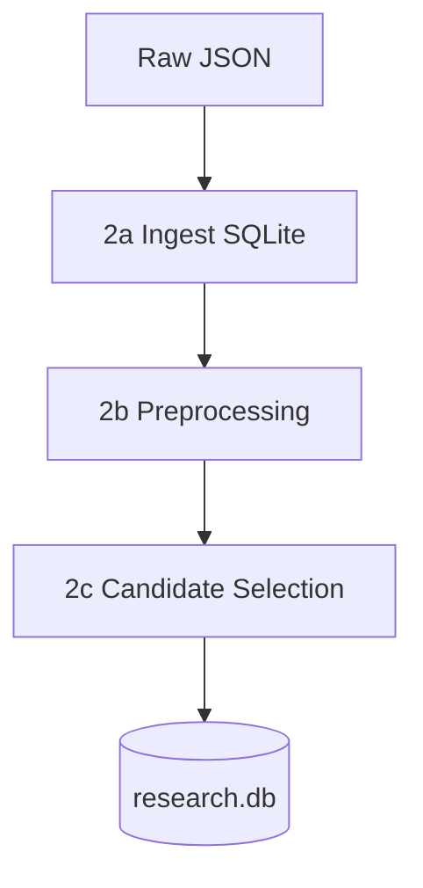
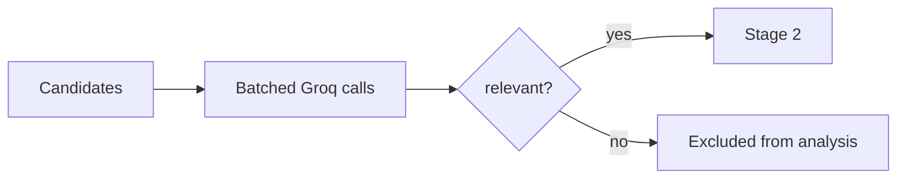
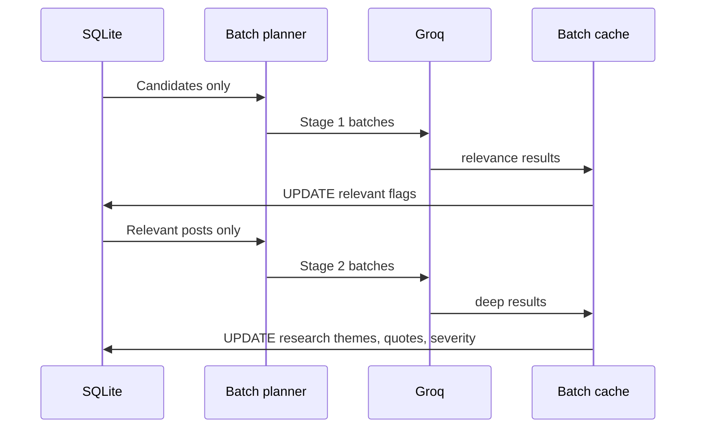
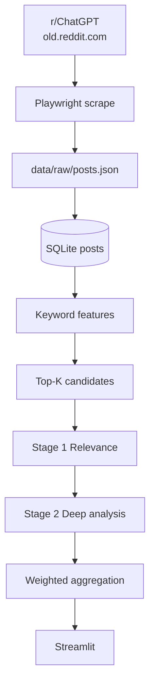

# ChatGPT Output Trust & Evaluation Lab — Architecture

**Academic assignment scope.** Design document — implementation tracked in [`IMPLEMENTATION_PLAN.md`](IMPLEMENTATION_PLAN.md).

**Version:** 3.6 — Phase 1 locked · Groq primary LLM · seven research themes.

---

## Phase 1 status (locked)

**`PHASE_1_LOCKED = TRUE`** — Phase 1 is a **one-time collection step** and has **already been completed**. Subsequent development assumes the existing validated dataset as the input source.

| Field | Value |
|-------|--------|
| Authoritative posts | `data/raw/posts_20260529.json` (1,091 unique posts) |
| Manifest | `data/raw/collection_manifest.json` |
| Scope | r/ChatGPT · 9 months · full-body enrichment · validated |

**Policy:** Do not rerun collection, overwrite raw files, or auto-trigger Phase 1. Pipeline entry is **Phase 2 onward** (`scripts/run_from_phase2.ps1`). See [`PHASE_1_CHECKPOINT.md`](PHASE_1_CHECKPOINT.md) and `project_state.yaml`.

---

## 1. Research objective

### What this study is about

The goal is **not** to analyze all general discussion in r/ChatGPT.

The goal is to **identify and analyze posts that discuss**:

| Research theme (Phase 3 / Stage 2) | What it captures |
|-----------------------------------|------------------|
| **Confident but Incorrect Outputs** | Hallucinations, fabricated facts or citations, confidently wrong answers |
| **User Trust Breakdown** | Loss of trust, skepticism, disappointment, trust erosion |
| **Over-Reliance on AI Outputs** | Emotional dependence, delegation of logic, companionship, over-trust |
| **User Evaluation & Verification Behavior** | Fact-checking, validation, cross-verification, critical audit |
| **Real-World Impact of AI Outputs** | Legal, academic, health, security, financial, or career consequences |
| **Persuasive Outputs & Trust Formation** | Certainty signals, perceived intelligence, trust-building tone |
| **Needs Manual Review** | Low confidence classifications, borderline cases, mixed themes |

These seven themes are the **authoritative taxonomy for analysis and reporting**. They are assigned in **Stage 2** from **full post text** (`title` + `selftext`), not from keyword hit counts alone.

**Preprocessing keyword categories** (Confidence, Hallucinations, Trust, Trust Loss, Consequences) remain in Phase 2 as **supporting features** for ranking and candidate selection only. They approximate retrieval relevance; they are **not** final research themes and must not be used as the primary theme labels in aggregates or the dashboard.

### What the platform must do

1. **Collect** a broad r/ChatGPT corpus (9 months) without assuming every post is on-topic.  
2. **Preprocess** deterministically to score keyword relevance (no LLM).  
3. **Select candidates** by keyword relevance + Reddit score before any LLM call.  
4. **Filter** with an LLM relevance stage (Stage 1).  
5. **Analyze** survivors with deep **research-theme** labeling (Stage 2) using full post context.  
6. **Aggregate** with vote weighting for prevalence and evidence.  
7. **Present** results in a Streamlit dashboard for researcher exploration.

### Design principles (unchanged core, updated emphasis)

| Principle | How it shows up |
|-----------|-----------------|
| **Targeted analysis, broad collection** | Collect widely; narrow before LLM. |
| **Cost-aware funnel** | Most posts never reach Groq/Gemini. |
| **Votes as weight** | Score used in ranking candidates and final prevalence. |
| **Small data, simple files** | SQLite + JSON; no vector DB or search engine. |
| **Token-safe LLM batches** | 50–100 posts per request until token budget (both LLM stages). |
| **Reproducibility** | Versioned config, prompts, batch caches, manifests. |
| **Honest limits** | Observational Reddit data; no causal claims in UI or exports. |
| **Evidence over speed** | `fetch_full_post_content: true` — full post pages scraped for every candidate; do not disable to save time. |

---

## 2. Scope and constraints

| Constraint | Value |
|------------|--------|
| **Source** | **r/ChatGPT only** (`ChatGPT`) |
| **Content** | Posts only (title + selftext). No comments. |
| **Time window** | Last **9 months** (`created_utc`) |
| **Collection** | **Hybrid Collection**: Reddit public JSON API (Primary) + Playwright browser fallback (Secondary); **`fetch_full_post_content: true` (required)** |
| **LLM** | **Groq (primary)**; **Gemini** if Groq quota/errors per batch |
| **LLM input** | **Candidates only** → Stage 1 → Stage 2 relevant only |
| **Batching** | Adaptive token packing; target **50–100 posts/request** |
| **Excluded tech** | pgvector, OpenSearch, UMAP, HDBSCAN, separate API server |
| **Deployment** | **Streamlit** (local or Community Cloud with pre-built DB) |

**Rationale for r/ChatGPT-only:** The research question concerns ChatGPT communication and trust dynamics in the primary user community for that product. A single-subreddit design simplifies collection, methodology, and reporting.

---

## 3. Cost optimization funnel

The architecture **explicitly** avoids sending thousands of irrelevant posts to the LLM.

```
Collection          →  N_raw posts (all retrieved in 9-month window)
       ↓
Keyword filtering   →  N_preprocessed (features on every post; no LLM)
       ↓
Candidate selection →  N_candidates (top K by relevance + score)
       ↓
LLM Stage 1         →  N_relevant (relevance filter)
       ↓
LLM Stage 2         →  N_analyzed (deep theme + evidence + severity)
       ↓
Aggregation         →  Weighted prevalence & evidence catalog
       ↓
Dashboard           →  Research exploration & findings
```

| Stage | Typical reduction | Cost |
|-------|-------------------|------|
| Collection | — | Playwright browser (no Reddit API) |
| Preprocessing | 0% (all posts scored) | CPU only |
| Candidate selection | 60–90% dropped | CPU only |
| LLM Stage 1 | Additional 30–60% dropped | **Paid** |
| LLM Stage 2 | Only relevant posts | **Paid** (smaller than Stage 1) |

**Example (illustrative):** 8,000 collected → 1,200 candidates → 400 relevant → 400 deep-analyzed.  
**LLM calls:** ~12–25 Stage 1 batches + ~8–15 Stage 2 batches (token-dependent), not 80+ batches on the full corpus.

Document actual funnel counts in `methodology_snippet.txt` for the academic write-up.

---

## 4. Master workflow diagram



---

## 5. Phasewise overview



| Phase | Name | LLM? | Output |
|-------|------|------|--------|
| **1** | Reddit collection (Hybrid JSON + Playwright fallback) | No | Raw JSON + manifest |
| **2** | Ingest, preprocessing, candidate selection | No | SQLite with features + `is_candidate` |
| **3** | Two-stage AI (relevance → deep) | Yes | Batch JSON + enriched columns |
| **4** | Theme aggregation | No* | CSV/JSON aggregates |
| **5** | Streamlit dashboard | Optional† | Interactive views |

\*No LLM in aggregation. †Optional on-demand “Final findings” draft button.

**Phase 0 (optional):** Ethics note, Playwright setup (historical), Groq/Gemini keys (Phase 3+), `config.yaml`, prompt versions. **Phase 1 collection is complete and locked.**

---

## Phase 1 — Reddit collection (Hybrid JSON API + Playwright Fallback)

### Objective

Collect **all posts available** from **r/ChatGPT** within the **last 9 months** using **Reddit public JSON endpoints as the primary collection method**, falling back automatically to **Playwright browser-based scraping** if blocked or on failure. Do **not** filter by research keywords at this stage.

### Tooling

| Component | Choice | Why |
|-----------|--------|-----|
| Primary Scraper | **Urllib HTTP Client** | Native standard library, zero-dependency, bypasses browser-level CDNs, 10x faster |
| Primary Target | **www.reddit.com JSON API** | Enpoints `/search.json`, `/new.json`, `/top.json` yield clean, structured post metadata |
| Secondary Fallback | **Playwright** (Chromium) | Automatic fallback if the JSON API is blocked, fails, or is rate-limited |
| Target site | **old.reddit.com** (Fallback) | Simpler HTML than new Reddit; stable listing + `next` pagination |
| Parser | **BeautifulSoup** (Fallback) | Parse post tiles from listing HTML offline and in tests |
| Strategy | **`/new/`** + **`/top/?t=year`** + **keyword search** | Maximize recall for research themes before Phase 2 |
| Config | **`config.yaml`** | Delays, page limits, custom User-Agents, persistent session |
| Full body | **`fetch_full_post_content: true`** | Query `/comments/{id}/{title}.json` primary, Playwright post page fallback |

### Collection logic

1. `date_floor = today − 9 months`.
2. **Persistent session context:** Initialize a persistent HTTP connection and cookie jar context (`urllib.request.HTTPCookieProcessor`) using a custom browser-like `User-Agent`.
3. **Primary Scrape (JSON API):**
   - For each listing/query, build the JSON endpoint URL with paging parameter `after` (limit 100).
   - Sleep for a **randomized delay** (`page_delay_seconds * random.uniform(0.8, 1.5)`) between calls to spoof human-like request pacing.
   - If successful, parse the JSON directly into `ScrapedPost` objects.
4. **Secondary Fallback (Playwright):**
   - If the JSON API request fails or is blocked, log the failure and initiate a browser session context.
   - Crawl the target pages using the system Chrome/Edge or default Playwright Chromium browser.
5. **Deduplicate by post `id`** globally across listings and searches (keeping the highest score).
6. **Full content pass** (when `fetch_full_post_content: true`):
   - For each unique post, try querying its JSONcomments endpoint primary.
   - If that fails, invoke Playwright to navigate to the thread URL, and extract the complete OP `selftext` from the DOM.
   - Replace `selftext` with the longer of listing excerpt vs full body (`merge_selftext`).
7. **No LLM** at collection — search queries are for **retrieval breadth** only.



### Stored fields

| Field | Notes |
|-------|--------|
| `title` | Post title |
| `selftext` | **Full body when available** (post-page fetch); otherwise listing excerpt |
| `score` | Upvote count from listing |
| `created_utc` | Parsed from `<time datetime>` |
| `url` | Full thread URL |
| `subreddit` | Always `ChatGPT` |
| `id` | Reddit post id (for dedupe and downstream joins) |

### Scraping reality (document in methodology)

- **No Reddit API** — coverage = pages successfully scraped within rate limits.
- Login walls, layout changes, or bot detection may reduce N — log `listings_executed` and `stopped_reasons` in manifest.
- **Academic ethics:** cite scraping method, respect delays, state Reddit ToS consideration in limitations.
- **Full-body fetch is mandatory** (`fetch_full_post_content: true`). Collection is intentionally slower: one post-page request per candidate improves evidence for overconfidence, hallucination, trust, and consequence analysis. **Do not disable for speed.**
- Tune `page_delay_seconds` only to avoid rate limits — not to skip full bodies.
- Link-only posts may still have empty `selftext`; title remains the available evidence.

### Deliverables

- `data/raw/posts_YYYYMMDD.json`
- `data/raw/collection_manifest.json` with `collection_method: playwright_browser_scrape`, `scraper.base_url`, no keyword filters

### Setup

```bash
pip install -r requirements.txt
playwright install chromium
```

### Exit criteria

- Single subreddit `ChatGPT` only  
- No keyword predicates in collection code path  
- Manifest records Playwright + old.reddit.com  
- Date range on collected posts fits 9-month window  

---

## Phase 2 — Ingest, preprocessing, candidate selection

Phase 2 has **three sub-stages**. None use an LLM.



### 2a — Ingest

- Load raw posts into SQLite table `posts`.
- `text = title + "\n\n" + selftext`.
- **Vote weight** (used throughout later phases):

```
weight = ln(1 + max(score, 0))
```

Optional cap at p95 to limit viral dominance.

### 2b — Preprocessing layer

**Purpose:** Attach deterministic relevance signals for ranking. **Do not** send all posts to the LLM.

For **each post**, compute:

| Field | Description |
|-------|-------------|
| `text_length` | `len(text)` |
| `keyword_match_count` | Total matches across all categories (document whether multiple hits in same keyword count once or multiply) |
| `match_confidence` | Hits in **Confidence** category |
| `match_hallucinations` | Hits in **Hallucinations** category |
| `match_trust` | Hits in **Trust** category |
| `match_trust_loss` | Hits in **Trust Loss** category |
| `match_consequences` | Hits in **Consequences** category |
| `category_hit_count` | Number of categories with ≥1 match (0–5) |

#### Keyword categories (fixed lists)

| Category | Keywords |
|----------|----------|
| **Confidence** | confident, confidence, certain, certainty, overconfident |
| **Hallucinations** | hallucination, fabricated, invented, made up, fake citation |
| **Trust** | trust, trusted, relied on, believed |
| **Trust Loss** | lost trust, skeptical, disappointed |
| **Consequences** | failed, grade, work, legal, health, money, mistake |

Matching: case-insensitive substring search on `text`. Multi-word phrases matched as phrases.

Store in `post_features` table or columns on `posts` (implementation choice).

**Rationale:** Keyword features are transparent, reproducible, and cheap. They approximate “might discuss our research program” for **ranking and funneling** without LLM cost. They do **not** define the final thematic taxonomy (see §1 and Phase 3).

#### Preprocessing keywords vs research themes

| Layer | Role | Used for |
|-------|------|----------|
| **Keyword categories** (Phase 2) | Deterministic substring features | Candidate ranking, optional LLM hints, methodology transparency |
| **Research themes** (Phase 3 Stage 2) | Semantic labels from full `text` | Aggregation, dashboard, academic findings |

A post may score highly on `match_hallucinations` but be primarily labeled `verification_fact_checking` in Stage 2 if the narrative centers on the user catching an error. The LLM resolves that using context; keyword counts must not override Stage 2 labels.

### 2c — Candidate selection layer

**Purpose:** Rank posts and send only the **highest-value candidates** to Stage 1 LLM.

#### Ranking formula (recommended)

```
relevance_raw = keyword_match_count + (2 × category_hit_count)
rank_score    = w_kw × norm(relevance_raw) + w_vote × norm(score)
```

- `norm(x)` = min-max or percentile scaling across corpus (document in config).
- Default weights: `w_kw = 0.6`, `w_vote = 0.4` (tunable in `config.yaml`).

#### Selection rule

- Sort all posts by `rank_score` descending.
- Mark `is_candidate = 1` for top **K** posts (`max_candidates` in config, e.g. 800–1500).
- Posts with `keyword_match_count = 0` may still enter top-K via very high score — optional rule: require `keyword_match_count >= 1` for candidates (recommended for research focus).

**Rationale:** Combines **textual relevance** (keywords) with **community salience** (upvotes), matching the requirement that widely supported experiences carry more weight while reducing noise.

#### Deliverable

`data/aggregated/candidate_selection_report.json`:

- `N_raw`, `N_candidates`, `K`, weights, optional minimum keyword rule.

### Exit criteria (Phase 2)

- Every raw post has preprocessing features.  
- `N_candidates << N_raw` (typically).  
- Candidate set documented for methodology appendix.  

---

## Phase 3 — Two-stage AI pipeline

Only posts with `is_candidate = 1` enter Phase 3. Both stages use **adaptive token batching** (50–100 posts per request until budget).

**Thematic analysis principle:** Stage 2 assigns one of **seven research themes** (§1) using the **full post** (`text`). Phase 2 keyword columns (`match_confidence`, `match_hallucinations`, etc.) may be passed as **optional hints** in the batch payload but must be labeled as non-authoritative supporting signals. The model must not treat keyword hit counts as ground truth for theme assignment.

### LLM policy

| Priority | Model | When |
|----------|--------|------|
| 1 | **Groq** | Default for Stage 1 and Stage 2 (`GROQ_API_KEY`) |
| 2 | **Gemini** | Per-batch retry on Groq 429/quota/error |

### Adaptive batching (both stages)

| Parameter | Typical value |
|-----------|----------------|
| `target_posts_min` | 50 |
| `target_posts_max` | 100 |
| `max_input_tokens` | Model-dependent (leave headroom for output) |
| `reserved_output_tokens` | Stage 1: smaller; Stage 2: larger (quotes + severity) |

```
post_token_budget = max_input_tokens - reserved_system - reserved_output
```

Greedy pack by token count; pre-flight validate; split on overflow. Cache each `batch_XXX_results.json`.

Separate plans: `data/batches/relevance/batch_plan.json`, `data/batches/deep/batch_plan.json`.

---

### Stage 1 — LLM relevance filter

**Question:** Is this post substantively about ChatGPT (or comparable AI assistant) communication, trust, reliability, verification, accountability, or consequences of relying on model output — i.e. within the scope of the **seven research themes**?

**Input per post (required):**

| Field | Source | Notes |
|-------|--------|-------|
| `id` | `posts.id` | Join key |
| `text` | `posts.text` | **Primary signal** — full `title` + `selftext` |
| `score` | `posts.score` | Community salience context |

**Input per post (optional, supporting only):**

| Field | Source | Notes |
|-------|--------|-------|
| `keyword_summary` | `post_features` | Category hit counts; **hints only** — not a relevance decision rule |

**Output per post:**

```json
{
  "id": "abc123",
  "relevant": true,
  "relevance_score": 0.82,
  "reason": "User describes believing a confident wrong medical answer and lost trust afterward."
}
```

| Field | Use |
|-------|-----|
| `relevant` | If `false`, post **does not** proceed to Stage 2 |
| `relevance_score` | 0–1; optional threshold in config |
| `reason` | Audit trail for researcher spot-checks |

**Rationale:** First LLM pass is lightweight — drops general ChatGPT tips, memes, and product news that passed keyword heuristics. Relevance is judged from **narrative content**, not from `keyword_match_count` thresholds.

**Prompt:** `prompts/relevance_v1.txt` — instruct model to read full `text` and ignore keyword-only posts with no substantive discussion.



---

### Stage 2 — Research theme analysis

**Input:** Stage 1 posts where `relevant = true`.

**Required input per post:**

| Field | Source | Notes |
|-------|--------|-------|
| `id` | `posts.id` | |
| `text` | `posts.text` | **Authoritative** — assign themes from full narrative |
| `score` | `posts.score` | Optional context |

**Optional supporting fields** (same as Stage 1 — do not use as primary labels):

`keyword_summary` from `post_features` (per-category hit counts).

**Output per post:**

```json
{
  "id": "abc123",
  "primary_theme": "overconfident_hallucinations",
  "secondary_themes": ["user_over_trust"],
  "theme_rationale": "Post centers on a fabricated citation accepted because the model sounded certain.",
  "evidence_quote": "verbatim substring from text",
  "severity": "medium",
  "model_confidence": 0.88
}
```

#### Research themes (fixed enum — Stage 2 only)

These slugs are the **only** values allowed for `primary_theme` and `secondary_themes[]` in aggregation and the dashboard.

| `primary_theme` slug | Display name | Typical signals in `text` |
|----------------------|--------------|---------------------------|
| `overconfident_incorrect_outputs` | Confidently Incorrect Outputs | Fabricated/wrong facts plus certainty tone; fake citations; wrong answers |
| `user_trust_breakdown` | User Trust Breakdown | Loss of trust, disappointment, skepticism, reduced reliance after bad output |
| `over_reliance_on_ai_outputs` | Over-Reliance on AI Outputs | Believed or acted without checking; emotional dependence; companionship |
| `user_evaluation_verification_behavior` | User Evaluation & Verification Behavior | Fact-checking, validation, cross-verification, prompt auditing |
| `real_world_impact_of_ai_outputs` | Real-World Impact of AI Outputs | Harm to work, grades, health, money, legal, security, or career |
| `persuasive_outputs_trust_formation` | Persuasive Outputs & Trust Formation | Certainty signals, perceived intelligence, trust building mechanisms |
| `needs_manual_review` | Needs Manual Review | Low confidence classifications, borderline cases, mixed themes |

**Assignment rules (prompt-enforced):**

1. Read the **entire** `text` before choosing `primary_theme`.
2. Choose the theme that best matches the **dominant user experience or narrative**, not the highest keyword category count.
3. Add `secondary_themes` only when another research theme is clearly present (0–3 items).
4. Use `mixed_or_multitheme` sparingly when multiple themes are equally central.
5. Do **not** map keyword category names (e.g. `match_trust_loss`) directly to `primary_theme` — semantic judgment required.

#### Optional analytic tags (not research themes)

Free-form `secondary_labels` (e.g. `chatgpt_mentioned`, `comparison_other_tools`, `medical_context`) may be stored for exploration but are **excluded** from weighted theme prevalence in Phase 4.

#### Severity

`low` | `medium` | `high` — researcher-oriented harm salience (not medical diagnosis).

#### Validation

- `evidence_quote` must be a substring of `text`; discard invalid rows or flag for review.
- `primary_theme` and each `secondary_themes[]` entry must be in the fixed enum above.
- Reject or quarantine rows where `theme_rationale` contradicts `evidence_quote` (spot-check sample).

**Prompt:** `prompts/deep_analysis_v1.txt` — include theme definitions, assignment rules, and explicit instruction that keyword summaries are non-binding.

**Rationale:** Deep pass runs on a **small, vetted** set — enables richer schema (multi-theme, rationale, quotes) within budget while keeping a **stable seven-theme** framework for the academic write-up.

---

### Phase 3 processing sequence



### Exit criteria (Phase 3)

- Funnel metrics logged: `N_candidates` → `N_relevant` → `N_analyzed`  
- ≥90% valid `evidence_quote` in Stage 2  
- `llm_usage.json` with per-stage token estimates  

---

## Phase 4 — Aggregation

**Input:** Posts with Stage 2 outputs only (plus weights from Phase 2).

### Vote-weighted metrics

Use `weight = ln(1 + score)` for:

| Metric | Formula |
|--------|---------|
| Raw theme count | `COUNT(*)` per `primary_theme` |
| Weighted theme count | `SUM(weight)` per `primary_theme` |
| Weighted prevalence | `SUM(weight WHERE theme=T) / SUM(weight)` over analyzed posts |
| Monthly trend | `strftime('%Y-%m', created_utc)` + theme |
| Trust erosion metrics | Counts/weights for `trust_erosion` research theme; optional cross-tab with Phase 2 `match_trust_loss` (supporting feature only) |
| Severity distribution | Histogram of `severity` (raw + weighted) |
| **Reddit score impact** | Theme prevalence by score decile or bin (does high-upvote content differ?) |

### Evidence outputs

- Top **N** posts per theme by `weight` with `evidence_quote`, `permalink`, `severity`.
- `representative_quotes.json` for dashboard.

### Deliverables

- `data/aggregated/theme_summary.csv`
- `data/aggregated/severity_summary.csv`
- `data/aggregated/score_impact.csv`
- `data/aggregated/trust_erosion.json`
- `data/aggregated/evidence_by_theme.json`
- `data/aggregated/methodology_snippet.txt` (includes **funnel table** + weight formula)

---

## Phase 5 — Interactive dashboard (Streamlit)

Read-only SQLite + precomputed aggregates. **No LLM on page load.**

### Required views

| View | Content |
|------|---------|
| **Theme distribution** | Bar chart: raw counts by `primary_theme` |
| **Weighted theme distribution** | Same chart using `SUM(weight)` |
| **Trust erosion metrics** | Dedicated panel: `trust_erosion` theme, trust-loss labels, trend over time |
| **Severity distribution** | Counts by `low` / `medium` / `high` (raw + weighted) |
| **Reddit score impact** | Theme breakdown by score bins; scatter or heatmap |
| **Evidence explorer** | Filterable table: theme, severity, min score, date; link to Reddit |
| **Representative quotes** | Top weighted quote per theme with context |
| **Final findings** | Optional: researcher pins evidence → one Groq call → draft bullets + limitations template |

### Sidebar: methodology funnel

Display live counts from manifest:

`Collected → Preprocessed → Candidates → Relevant (S1) → Analyzed (S2)`

Plus disclaimer: *observational data; correlation not causation.*

### Exit criteria

- All seven view areas implemented  
- `streamlit run app.py` works against pre-built `research.db`  

---

## 6. Technology stack (minimal)

| Layer | Technology |
|-------|------------|
| Language | Python 3.11+ |
| Reddit collection | **Playwright** + BeautifulSoup (old.reddit.com) |
| Database | SQLite |
| Preprocessing | Python + regex/substring (no LLM) |
| LLM | Groq (+ Gemini fallback) |
| Token counting | tiktoken |
| Orchestration | Plain scripts |
| Dashboard | Streamlit + Plotly |
| Config | `config.yaml` + `.env` |

**Not used:** pgvector, OpenSearch, UMAP, HDBSCAN, Redis, separate frontend API.

---

## 7. End-to-end data flow



**Lineage:** `post.id` → raw file → `post_features` → `is_candidate` → `batch_relevance_*` → `batch_deep_*` → aggregates → dashboard.

---

## 8. Project layout (updated)

```
reddit-analyser/
├── config.yaml
├── phase1/                    # Playwright scrape + HTML parser
│   ├── collector.py
│   ├── playwright_scraper.py
│   └── parser.py
├── phase2/                    # preprocess.py, select_candidates.py
├── phase3/                    # relevance.py, deep_analysis.py
├── scripts/
│   ├── collect.py
│   ├── ingest.py
│   ├── plan_batches.py
│   ├── run_relevance.py
│   ├── run_deep_analysis.py
│   └── aggregate.py
├── data/
│   ├── raw/
│   ├── batches/relevance/
│   ├── batches/deep/
│   └── aggregated/
├── prompts/
│   ├── relevance_v1.txt          # Stage 1: full-text relevance (keywords optional hint)
│   └── deep_analysis_v1.txt      # Stage 2: seven research themes from full text
├── app.py
└── docs/
    ├── ARCHITECTURE.md
    └── IMPLEMENTATION_PLAN.md
```

---

## 9. Deployment (low cost)

| Step | Where |
|------|--------|
| Collect + preprocess + LLM | **Local machine** (keys on laptop) |
| Dashboard | Streamlit local or Cloud with **pre-built DB** (no LLM in production app) |

```bash
# Phase 1 complete — do not rerun collect.py unless explicitly approved
.\scripts\run_from_phase2.ps1
# or step-by-step:
python scripts/ingest.py
python -m phase2.preprocess
python -m phase2.select_candidates
python scripts/run_relevance.py
python scripts/run_deep_analysis.py
python scripts/aggregate.py
streamlit run app.py
```

---

## 10. Research quality

| Requirement | Approach |
|-------------|----------|
| Focused corpus | Keyword + candidate gate + Stage 1 relevance |
| Recurring themes | Fixed **seven-theme** `primary_theme` enum in Stage 2 (LLM from full `text`) |
| Representative evidence | Verbatim quotes + top posts by weight |
| Community signal | Score in candidate rank + weighted prevalence |
| Cost discipline | Document funnel drop-off at each stage |
| Transparency | Keyword lists (Phase 2) and research theme definitions (Phase 3) in appendix |

**Trade-offs:**

- Keyword preprocessing may miss novel phrasing; Stage 1 LLM recovers some false negatives if they rank into top-K.
- Keyword features must not be reported as final themes — always distinguish **preprocessing signals** from **Stage 2 research themes**.
- Stage 2 may disagree with keyword hints by design; document disagreement rate in methodology (optional QA sample).

---

## 11. Risks and mitigations

| Risk | Mitigation |
|------|------------|
| Incomplete Reddit history | Document listing method and N |
| Keyword blind spots | Stage 1 LLM; optional lower `max_candidates` threshold |
| LLM mislabels | Quote validation; manual review sample |
| Overclaiming causation | Dashboard disclaimer + findings template |
| Cost overrun | Candidate cap K; cached batches; Gemini only on failure |
| General r/ChatGPT noise | Three-layer filter before deep analysis |

---

## 12. Phase timeline

| Phase | Effort |
|-------|--------|
| 0 Setup | 0.5 day |
| 1 Collect (r/ChatGPT, 9 mo) | 1–2 days |
| 2 Preprocess + select | 1 day |
| 3 LLM S1 + S2 | 1–2 days |
| 4 Aggregate | 0.5 day |
| 5 Streamlit | 1–2 days |

---

## 13. Deliverables checklist

- [ ] `collection_manifest.json` (ChatGPT-only, no collect keywords)
- [ ] `candidate_selection_report.json`
- [ ] `research.db` with funnel flags
- [ ] Stage 1 & 2 batch caches + `llm_usage.json`
- [ ] Aggregated metrics (themes, severity, score impact, trust erosion)
- [ ] Streamlit dashboard (all required views)
- [ ] Methodology with funnel table and weight formula

---

## 14. Document control

| Field | Value |
|-------|-------|
| Version | **3.6** |
| Phase 1 | **Locked** — `posts_20260529.json` |
| LLM | **Groq** primary |
| Subreddit | **r/ChatGPT only** |
| Collection | Playwright: listings + search + **full post body** fetch per URL (always on) |
| LLM stages | Relevance filter → Deep analysis |
| Pre-LLM | Preprocessing + candidate selection |
| UI | Streamlit |
| Clustering | None |

---

## 15. Change log

### v3.5 → v3.6

| Area | Change |
|------|--------|
| Phase 1 | **`PHASE_1_LOCKED=TRUE`** — authoritative dataset frozen; collection guarded |
| LLM | **Groq** replaces Grok/xAI as primary provider (`GROQ_API_KEY`) |
| Pipeline | Default entry `scripts/run_from_phase2.ps1`; backup script for locked artifacts |

### v3.4 → v3.5

| Area | Change |
|------|--------|
| Research themes | Replaced legacy Stage 2 enum (`hallucination_or_false_info`, etc.) with **seven higher-level research themes** aligned to the academic research program |
| Phase 2 keywords | Clarified Confidence / Hallucinations / Trust / Trust Loss / Consequences as **preprocessing-only** supporting features — not final themes |
| Stage 2 input | **Full `text` required** for theme assignment; `keyword_summary` optional and non-authoritative |
| Stage 2 output | Added `secondary_themes[]`, `theme_rationale`; renamed `confidence_score` → `model_confidence` |
| Aggregation / UI | All prevalence and dashboard charts use **research theme slugs** from Stage 2 only |

### v3.3 → v3.4

| Area | Change |
|------|--------|
| Collection transport | Added **Hybrid JSON API Fallback**: Reddit public JSON API (`.json`) as primary with persistent session and randomized delays; Playwright Chromium as secondary fallback |
| Scraper engine | Direct `urllib` HTTP client (primary) + Playwright browser automation (secondary) |
| Stealth bypass | Integrated `delete navigator.__proto__.webdriver;` on Playwright page loads to bypass Cloudflare bot blocks |

### v3.2 → v3.3

| Area | Change |
|------|--------|
| Full body | `fetch_full_post_content: true` — visit each post URL, extract complete selftext |
| Evidence | Maximizes text for overconfidence, hallucination, trust, consequence extraction |
| Manifest | `full_content_stats` (attempted / enriched / failed) |

### v3.1 → v3.2

| Area | Change |
|------|--------|
| Collection | Added **16 keyword-driven** r/ChatGPT search URLs alongside `/new/` and `/top/` |
| Dedup | Global by post `id` across listings + all searches |
| Config | `search_queries`, `max_pages_per_search` |

### v3.0 → v3.1

| Area | Change |
|------|--------|
| Collection transport | Reddit API (PRAW) → **Playwright** browser scrape |
| Scrape target | **old.reddit.com** listing pages |
| Credentials | No `REDDIT_CLIENT_ID` / secret for Phase 1 |
| Tests | HTML fixtures + mock scraper; optional live Playwright integration test |

### v2.x → v3.0

| Area | Before (v2.1) | After (v3.0) |
|------|---------------|--------------|
| Research scope | Broad ChatGPT discourse | **Targeted themes** only |
| Subreddits | ChatGPT + chatgptcomplaints | **r/ChatGPT only** |
| Collection | Keyword search + filter | **Full listing** in window |
| Pre-LLM | None | **Preprocessing + candidate selection** |
| LLM | Single classification pass | **Stage 1 relevance + Stage 2 deep** |
| Cost model | Implied | **Explicit funnel** |
| Dashboard | General explorer | **Themes, weights, trust erosion, severity, score impact, findings** |

---

*This revision preserves the simplified SQLite + Streamlit + Groq stack. Phase 1 collection is complete; all downstream work uses the locked validated dataset and **minimizes LLM cost** through deterministic filtering before any model calls.*
