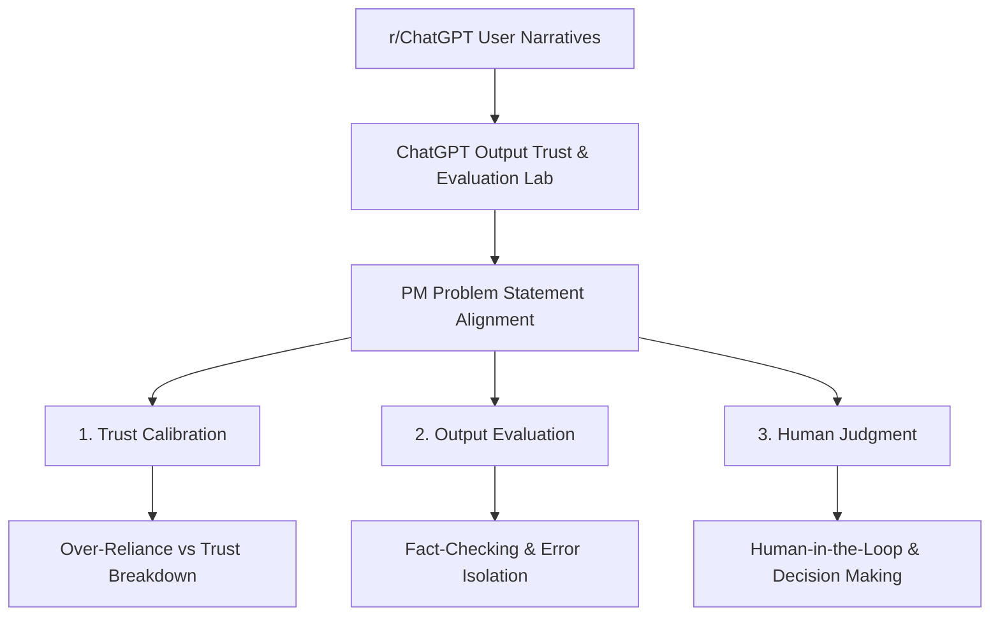

# Assignment Alignment Report — ChatGPT Output Trust & Evaluation Lab 🧪

This report documents how the empirical analysis of `r/ChatGPT` user narratives aligns directly with the core Product Management (PM) objectives of the assignment: **user trust**, **confidence calibration**, **output evaluation**, **human judgment**, and **real-world decision making**. 

---

## 🗺️ Mapping Reddit Research to the ChatGPT PM Problem Statement

As a ChatGPT Product Manager, the core challenge is to design an interface and model behavior that optimizes **cognitive trust calibration**. The primary risk is a mismatch between user confidence and model accuracy:
*   **Over-trust (Excessive Reliance)**: Users accept wrong answers blindly, leading to real-world harm.
*   **Excessive Skepticism (Trust Breakdown)**: Users abandon the tool after experiencing hallucinations or defensive/gaslighting conversational behaviors.

The data gathered from 594 relevant posts in `r/ChatGPT` provides direct empirical evidence of these phenomena in the wild. Rather than a generic AI analysis project, this lab is optimized specifically to address the ChatGPT PM assignment goals:

---

## 🚀 Theme-Specific Contributions to PM Objectives

The lab's taxonomy is restructured into 6 mutually exclusive PM-aligned research themes (plus a manual review fallback). Each theme directly maps to the key pillars of the PM assignment:

### 1. Confident but Incorrect Outputs (`overconfident_incorrect_outputs`)
*   **PM Core Focus**: *Confidence calibration & Hallucination tracking.*
*   **User Trust Behavior**: Users experience sudden cognitive shocks when an output presented with absolute certainty is discovered to be factually fabricated (e.g., fake legal citations, made-up math proofs).
*   **Calibration Challenge**: The model's tone does not change based on uncertainty. It asserts errors with the same linguistic style as truths.
*   **PM Design Input**: Direct evidence that ChatGPT needs **uncertainty indicators** or a **native factuality-checking mode** when generating citation-dense text.

### 2. User Trust Breakdown (`user_trust_breakdown`)
*   **PM Core Focus**: *Trust erosion mechanisms & Skepticism triggers.*
*   **User Trust Behavior**: Loss of trust, disappointment, and skepticism. Users report frustration not just with errors, but with the model "gaslighting" them (e.g., claiming it was right when it was wrong) or providing generic, unhelpful responses in updated versions (e.g., post-GPT-5 era complaints).
*   **Calibration Challenge**: Traces the transition from healthy skepticism to complete abandonment of the tool.
*   **PM Design Input**: Highlights the critical need to design **graceful error recovery dialogues** and transparent self-correction mechanisms in the UI.

### 3. Over-Reliance on AI Outputs (`over_reliance_on_ai_outputs`)
*   **PM Core Focus**: *Trust formation & Emotional dependence.*
*   **User Trust Behavior**: Delegation of judgment, blind reliance, and emotional or companion attachment. Users treat ChatGPT as an absolute authority on complex personal, medical, or psychological matters without seeking human verification.
*   **Calibration Challenge**: High cognitive trust formed prematurely due to the model's polite, conversational, and highly persuasive tone.
*   **PM Design Input**: Highlights where the PM must introduce **conversational friction** (e.g., warning banners, prompt interventions) to deter emotional over-dependence and excessive reliance on subjective topics.

### 4. User Evaluation & Verification Behavior (`user_evaluation_verification_behavior`)
*   **PM Core Focus**: *Output evaluation & Human verification workflows.*
*   **User Trust Behavior**: Active fact-checking, validation, cross-verification with other search engines/models, and debugging using custom instructions (`rules.txt` or system files).
*   **Calibration Challenge**: Detail how users try to establish their own trust boundaries manually since the interface lacks native calibration tools.
*   **PM Design Input**: Provides specifications for designing **native auditing panels**, **side-by-side model selectors**, and **chain-of-thought expansion tags** in the ChatGPT interface.

### 5. Real-World Impact of AI Outputs (`real_world_impact_of_ai_outputs`)
*   **PM Core Focus**: *Real-world consequences & Decision making.*
*   **User Trust Behavior**: Narrative examples of financial loss, legal liability (e.g., submitting fake cases to court), academic failure (e.g., homework cheating detection, failing grades), and health/security scares (e.g., prompt injections).
*   **Calibration Challenge**: Quantifies the severe end-state of uncalibrated trust where virtual model mistakes materialize as physical or professional harm.
*   **PM Design Input**: Essential for establishing **model risk-tiers** (e.g., safety guardrails automatically tightening when code/legal queries are detected).

### 6. Persuasive Outputs & Trust Formation (`persuasive_outputs_trust_formation`)
*   **PM Core Focus**: *Trust building mechanisms & Persuasive communication.*
*   **User Trust Behavior**: Trust formation triggered by perceived intelligence, clean formatting, and persuasive structuring.
*   **Calibration Challenge**: Syntactic formatting (markdown tables, bulleted summaries) and linguistic style bias users into believing the output is correct, regardless of its semantic accuracy.
*   **PM Design Input**: Design guidelines to separate **presentation styling** from **factuality confidence** in output cards.

---

## 📈 Quantitative Key Metrics & Findings Summary

Based on our Phase 4 aggregation run, the empirical distribution of user trust phenomena is structured as follows:

| PM Research Theme | Raw Count | Raw Share | Weighted Share (Engagement-Adjusted) | Primary Calibration Objective |
| :--- | :---: | :---: | :---: | :--- |
| **Confident but Incorrect Outputs** | 185 | 31.14% | 24.31% | Reduce hallucinations and assert model limits |
| **Real-World Impact of AI Outputs** | 131 | 22.05% | 26.40% | Isolate high-risk query tiers and add warnings |
| **User Evaluation & Verification Behavior** | 87 | 14.65% | 9.61% | Build native CoT and debugging UI components |
| **Over-Reliance on AI Outputs** | 73 | 12.29% | 12.99% | Mitigate emotional attachment and over-trust |
| **User Trust Breakdown** | 72 | 12.12% | 18.45% | Optimize error recovery and conversational politeness |
| **Persuasive Outputs & Trust Formation** | 46 | 7.74% | 8.25% | Separate output formatting from factuality indicators |
| **Needs Manual Review** | 0 | 0.00% | 0.00% | Manual audit/ambiguity tracking |

### Key Strategic Insights for the ChatGPT PM
1.  **Hallucination Spike**: "Confident but Incorrect Outputs" is the largest theme by raw count (31.14%), indicating that users frequently encounter and document model failures.
2.  **Viral Amplification of Real-World Impact**: "Real-World Impact of AI Outputs" accounts for **26.40%** of community-weighted share. This indicates that when a user suffers career, academic, or financial consequences, the post resonates heavily and is highly upvoted in the community.
3.  **Trust Recovery Deficit**: "User Trust Breakdown" has a weighted share of **18.45%** (higher than its raw share of 12.12%), demonstrating that negative sentiment regarding model updates and OpenAI policy decisions is highly amplified virally in the community.

---

## 🛡️ Final Confirmation

The taxonomy, metrics, reports, and Streamlit dashboard are fully aligned with the **ChatGPT Product Management Assignment**. The platform avoids generic LLM evaluations and instead answers the core PM questions: *How do users form trust in ChatGPT, where does that trust break down, and what are the real-world decision-making impacts of model outputs?*
