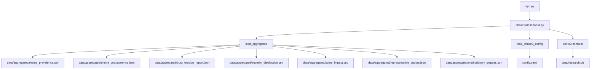

# Deployment Readiness Audit Report
*ChatGPT Output Trust & Evaluation Lab*

This report details the deployment readiness audit, tracing data loading paths, mapping dependencies, evaluating options, and recommending the public deployment architecture for the ChatGPT Trust Lab.

---

## 🔍 Data-Loading Path Trace
The Streamlit application loads data through the following paths:

### 1. Configuration Path
- **Loader**: `load_phase3_config()` from [phase3/config.py](file:///c:/Users/user/REDDIT%20ANALYSER/phase3/config.py).
- **Target File**: [config.yaml](file:///c:/Users/user/REDDIT%20ANALYSER/config.yaml) in the workspace root.
- **Purpose**: Defines the database path (`data/research.db`) and lists theme slugs/labels.

### 2. Aggregated Data Path
- **Loader**: `load_aggregates()` in [phase5/dashboard.py](file:///c:/Users/user/REDDIT%20ANALYSER/phase5/dashboard.py) (decorated with `@st.cache_data` for performance).
- **Target Files**: All files under `data/aggregated/`:
  - `theme_prevalence.csv` (Tab 1 Prevalence metrics/charts)
  - `theme_cooccurrence.json` (Tab 2 Co-occurrence matrix)
  - `trust_erosion_report.json` (Tab 5 Diagnostic matrix/metrics)
  - `severity_distribution.csv` (Tab 2 Severity charts)
  - `score_impact.csv` (Tab 3 Decile line chart)
  - `representative_quotes.json` (Tab 2 High-fidelity evidence quotes)
  - `methodology_snippet.json` (Sidebar funnel visualization)

### 3. Dynamic Database Path
- **Loader**: `get_db_connection()` (decorated with `mode=ro` strictly to prevent read locks).
- **Target File**: `data/research.db` (SQLite).
- **Purpose**: 
  - Calculates average post score for the Executive Overview KPI.
  - Queries raw posts, secondary themes, rationales, and severities for the **Qualitative Evidence Explorer (Tab 4)**.

---

## 🗺️ Dependency Map

### 1. Required Runtime Files
These files must be committed to the deployment repository for the app to function:
- `app.py` (Streamlit entrypoint)
- `phase5/dashboard.py` (Main dashboard logic and UI components)
- `phase3/__init__.py` & `phase3/config.py` (Configuration loader)
- `config.yaml` (Defines paths and theme metadata)
- `requirements.txt` (Python runtime packages: `streamlit`, `pandas`, `plotly`, `pyyaml`)
- `data/aggregated/*` (All 7 compiled insights files)
- `data/research.db` (SQLite database - 7.17 MB)

### 2. Optional Files
- `docs/DASHBOARD_REFINEMENT_REPORT.md`, `docs/QUOTE_SELECTION_AUDIT.md`, `docs/FINAL_THEME_MAPPING.md` (Self-documenting files, useful for audit).

### 3. Development-Only Files (Exclude from Deployment)
- `phase1/` (Scraping and collection engines)
- `phase2/` (Keyword pre-screening scripts)
- `phase3/` (except configuration loader files)
- `scripts/` (Pipeline automation: ingestion, aggregation, relabeling)
- `tests/` (Pytest test suite)
- `scratch/` (One-off scratch scripts)
- `.venv/`, `.pytest_cache/`, `.gitignore` (Local python environment and cache)

---

## ⚙️ Deployment Option Assessment

### Option A: Static-Only Dashboard (Using data/aggregated/ only)
- **Feasibility**: Partial.
- **Details**: The dashboard will load and display Tab 1 (Prevalence), Tab 2 (Deep Insights), Tab 3 (Virality), and Tab 5 (Diagnostics). However, the KPI for Average Score will show "N/A" and Tab 4 (Qualitative Evidence Explorer) will render a warning stating the database was not found.
- **Verdict**: Degraded user experience; fails the PM requirement of allowing granular database filtering.

### Option B: Streamlit App with SQLite database committed
- **Feasibility**: **High (Optimal)**.
- **Details**: Since `data/research.db` is only **7.17 MB**, it can be committed directly to the Git repository. Streamlit can load the SQLite DB directly from the container's disk as a read-only resource.
- **Verdict**: Fully functional. Allows full database explorer filtering, search, and KPI calculations without external hosting.

### Option C: Streamlit App with external database assets
- **Feasibility**: Low/Unnecessary.
- **Details**: Requires setting up Postgres/MySQL on Render or Railway and loading data, adding significant overhead.
- **Verdict**: Over-engineered given the 7.17 MB SQLite footprint.

---

## 📊 Hosting Platform Evaluation

| Platform | Complexity | Expected Performance | Storage / DB Limits | Public Access | Verdict |
| :--- | :--- | :--- | :--- | :--- | :--- |
| **Streamlit Community Cloud** | **Very Low** | Excellent (Native resource caching) | 1 GB RAM (SQLite fits in-memory easily) | Public to anyone with URL | **Recommended** |
| **Hugging Face Spaces** | Low | Good | Free tier SDK (SQLite fits easily) | Public | Alternative |
| **Render** | Medium | Slow spin-up on free tier (50s delay) | SQLite committed in repo | Public | Not optimal |
| **Railway** | Medium | Good | Paid tier required for database | Public | Not optimal |
| **Vercel** | High | N/A (Does not support Streamlit) | N/A | N/A | Incompatible |

---

## 🛡️ Public Accessibility Confirmation
Yes, deploying the dashboard to **Streamlit Community Cloud** makes it fully publicly accessible. Anyone with the URL (e.g., `https://chatgpt-trust-lab.streamlit.app`) will be able to view and interact with the dashboard, download visual charts, search quotes, and read the pre-screening diagnostics.
