# Comprehensive Project Journey Report
**ChatGPT Output Trust & Evaluation Lab (ChatGPT Trust Lab)**
*An Empirical Investigation of User Trust Calibration, AI Hallucinations, and Human Evaluation Dynamics*

---

## 1. Project Objective

### The Problem Statement
As Large Language Models (LLMs) like ChatGPT achieve unprecedented levels of linguistic fluency and conversational coherence, humans are increasingly prone to **automation bias**—the tendency to trust automated systems blindly, even in the presence of contradictory evidence. In high-stakes domains (legal, medical, software engineering, emotional support), this over-reliance can lead to severe real-world consequences, ranging from professional disbarment due to fabricated legal precedents to critical medical misdiagnoses.

However, existing research heavily focuses on synthetic model benchmarks (e.g. MMLU, GSM8K) rather than examining **how real-world users actually interact with, evaluate, and calibrate their trust in AI outputs**. 

### Why ChatGPT Trust and Confidence Calibration?
ChatGPT was selected as the subject of this study because it represents the most widely adopted consumer LLM, serving as a primary touchpoint for millions of users worldwide. Studying "trust calibration"—the degree to which a user's trust aligns with the actual reliability of the model—allows researchers to map out when and why users:
1.  **Over-rely**: Accepting hallucinations as facts.
2.  **Suffer Trust Erosion**: Losing faith in the tool's utility due to inconsistent safety filtering or minor errors.
3.  **Successfully Verify**: Deploying sophisticated auditing behaviors to catch errors.

### Research Goals
The core research objectives of this project were:
*   **Ingest and Analyze Real-World Evidence**: Capture authentic user experiences, complaints, and success stories regarding ChatGPT's outputs directly from active practitioner communities.
*   **Develop a Categorization Taxonomy**: Classify user trust dynamics and outcomes into mathematically discrete, human-aligned themes.
*   **Evaluate Keyword vs. Semantic Classifiers**: Measure the efficacy of traditional keyword pre-screening heuristics compared to deep semantic LLM evaluation.
*   **Quantify Community Virality**: Adjust raw prevalence rates to account for community engagement (upvotes), showing which narratives are actively amplified within the ecosystem.
*   **Deliver an Interactive Auditing Dashboard**: Renders a qualitative evidence explorer and metric diagnostics console to serve as a low-cost, open-source tool for future researchers.

### Expected Outcomes
A fully operational, verified database containing classified posts, structured insight tables mapping theme prevalence, virality trends, and diagnostic metrics, along with an interactive Streamlit application serving as the primary analytical portal.

---

## 2. System Architecture Overview

The ChatGPT Trust Lab employs a structured **five-phase hybrid architecture** that transitions from broad, low-cost data collection to high-fidelity semantic classification and interactive analytical visualizations.

```mermaid
graph TD
    %% Phase 1
    subgraph Phase 1: Ingestion
        P1_Source[r/ChatGPT old.reddit.com] -->|Playwright Scraper| P1_Raw[1,091 Raw Posts]
        P1_Raw -->|Deduplication| P1_Unique[1,091 Unique Records]
    end

    %% Phase 2
    subgraph Phase 2: Preprocessing
        P1_Unique -->|Heuristic Screening| P2_Scores[Keyword Density & Engagement]
        P2_Scores -->|Cutoff Filter| P2_Cand[729 Keyword Candidates]
    end

    %% Phase 3
    subgraph Phase 3: Semantic LLM
        P2_Cand -->|Llama 3.1 8B via Groq| P3_Rel[Stage 1: Relevance Filter]
        P3_Rel -->|Confirmed 594 Posts| P3_Deep[Stage 2: Taxonomy & Severity Classification]
        P3_Deep -->|SQLite Database| P3_Db[(data/research.db)]
    end

    %% Phase 4
    subgraph Phase 4: Aggregation
        P3_Db -->|Programmatic Compilation| P4_Csvs[theme_prevalence.csv<br>theme_cooccurrence.json<br>severity_distribution.csv<br>score_impact.csv<br>representative_quotes.json]
    end

    %% Phase 5
    subgraph Phase 5: Visualization
        P4_Csvs -->|Streamlit App| P5_Dash[Premium Interactive Dashboard]
        P3_Db -->|RO SQLite Connection| P5_Dash
    end

    style P3_Db fill:#8b5cf6,stroke:#3b82f6,stroke-width:2px;
    style P5_Dash fill:#0b0f19,stroke:#ec4899,stroke-width:2px;
```



*   **Phase 1 (Data Ingestion)**: Uses Playwright browser automation to scrape 1,091 raw posts from the active community `r/ChatGPT` across a 9-month temporal window.
*   **Phase 2 (Deterministic Pre-screening)**: Evaluates raw posts using simple substring keyword counts to score and identify candidate posts showing early trust indicators, retaining 729 candidates.
*   **Phase 3 (Two-Stage LLM Analysis)**: Uses `llama-3.1-8b-instant` via the Groq API fallback chain to first confirm relevance (Stage 1) and then semantically classify primary themes, secondary themes, severities, rationales, and exact quotes (Stage 2), outputting the records to `data/research.db` (594 relevant posts).
*   **Phase 4 (Insight Aggregation)**: Programmatically processes the SQLite database to compile structured CSV and JSON insight tables, including co-occurrence matrices, monthly trends, and programmatically ranked representative quotes.
*   **Phase 5 (Interactive Dashboard)**: A Streamlit-based dark-mode application displaying metrics, interactive charts, confusion matrices, and a highly responsive Qualitative Evidence Explorer allowing direct SQLite read-only filtering.

---

## 3. Phase 1 Data Collection

### Why Reddit & r/ChatGPT?
Reddit represents a highly active, organic practitioner landscape where users freely document their unvarnished, real-world experiences with software systems. Unlike structured customer feedback surveys, Reddit posts contain highly granular, context-rich self-reports. The subreddit `r/ChatGPT` is the largest centralized community dedicated to OpenAI's models, containing a massive diversity of users ranging from software developers and legal clerks to students and casual hobbyists.

### Scraping and Ingestion Architecture
To bypass aggressive anti-bot rate limits (HTTP 429), the data collection engine was designed as follows:
*   **Target Interface**: Scraped from `old.reddit.com` to avoid heavy client-side React rendering, lowering CPU/memory overhead and increasing speed.
*   **Playwright Engine**: Orchestrated a headless Chromium instance, blocking non-essential assets (CSS, images, advertisements) to minimize bandwidth.
*   **Search Strategy**: Targeted historical records using a diverse query list mapping key trust areas:
    *   `trust`, `trust_loss`, `hallucinate`, `lie`, `wrong`, `confident`, `consequence`, `consequences`
*   **Time Window**: Covered a **9-month historical window** ending in mid-2025/2026.
*   **Deduplication Process**: Posts were scraped across multiple query sweeps. The ingestion pipeline parsed the unique Reddit Post ID (`id`) and enforced a deterministic primary key constraint. If a post had already been logged under an earlier query, the parser bypassed it, ensuring 100% unique records.

### Ingestion Statistics
*   **Total Raw Posts Collected**: **1,091**
*   **Total Unique Posts Logged**: **1,091** (working tree deduplication verified).
*   **Metadata Saved**: Title, author, body text (`selftext`), upvote score, URL, creation timestamp, and search query origin.

---

## 4. Phase 2 Preprocessing Heuristics

### Heuristic Screening Model
To optimize developer cost and pipeline efficiency, the 1,091 raw posts were run through a fast, deterministic preprocessing script in Phase 2:
1.  **Keyword Matching**: The scraper scanned the title and body text for simple keyword categories:
    *   *Confidence*: `confident`, `certain`, `absolute`
    *   *Hallucinations*: `hallucinate`, `invent`, `fabricate`, `fake`
    *   *Trust*: `trust`, `rely`, `depend`
    *   *Consequences*: `consequence`, `fire`, `fail`, `lose`, `error`
2.  **Scoring Heuristic**: A candidate relevance score ($S$) was calculated for each post:
    $$S = (W_{\text{keywords}} \times N_{\text{matches}}) + (W_{\text{upvotes}} \times \ln(1 + \max(\text{score}, 0)))$$
    Where keywords served as the primary signal, and log-scaled community upvotes acted as a secondary signal of relevance.
3.  **Pruning Threshold**: A strict cutoff was applied. Posts containing zero keyword matches and very low engagement were pruned.

### Retention and Transition
*   **Raw Ingested Volume**: 1,091 posts
*   **Retained Candidates**: **729** posts
*   **Candidate Retention Rate**: **66.8%**
*   **Pruned Volume**: 362 irrelevant or empty posts.

### Why Keyword Matching Alone Fails
While Phase 2 successfully weeded out major noise, a metric audit proved the severe limitations of deterministic keyword rules:
*   **Heavy Noise (88.89% False Positive Rate)**: Most keyword matches were contextually irrelevant. For example, a post containing the word *"fire"* might describe a literal fire, a gaming setup, or colloquial praise (*"this new model is fire"*), rather than a professional termination consequence.
*   **The Inversion Problem**: Substring search cannot evaluate context. A sentence like *"I have zero trust issues with this tool"* triggers a positive keyword match for `trust` despite communicating the exact opposite.

This proved the critical need for a Phase 3 semantic stage.

---

## 5. Phase 3 LLM Analysis

Phase 3 transitions from heuristic screening to high-fidelity semantic parsing using a **two-stage LLM workflow** powered by `llama-3.1-8b-instant` via the Groq API.

```
       [ 729 Preselected Keyword Candidates ]
                       │
                       ▼
       ┌──────────────────────────────┐
       │      Stage 1 LLM filter      │
       │    (Confirm Relevance)       │
       └───────────────┬──────────────┘
                       │
             [ 594 Relevant Posts ]
                       │
                       ▼
       ┌──────────────────────────────┐
       │      Stage 2 LLM Parser      │
       │  (Theme, Severity, Quotes)   │
       └───────────────┬──────────────┘
                       │
                       ▼
       [(data/research.db SQLite Store)]
```

### Stage 1: Relevance Filtering
Each of the 729 preselected candidates was evaluated individually. The LLM parsed the full post text to determine if it represented a genuine, real-world narrative regarding ChatGPT trust, output evaluation, verification behavior, or consequences.
*   **Result**: **594 posts** were confirmed as relevant.
*   **Relevance Conversion Rate**: **81.5%** of pre-screened candidates (54.4% of original raw corpus).

### Stage 2: Deep Semantic Classification
For the 594 confirmed relevant posts, the LLM extracted:
1.  **Primary Theme**: Selected from the core research taxonomy.
2.  **Secondary Themes**: Logged as an array of overlapping sub-themes.
3.  **Severity Level**: Classed as `high`, `medium`, or `low` based on real-world impact.
4.  **Verbatim Evidence Quote**: The exact sentence within the post text supporting the classification.
5.  **Analytical Rationale**: A concise research explanation detailing the classifier's decision.

### Pipeline Infrastructure
*   **API Client & Timeout**: Custom Groq client with a robust 60-second request timeout and an exponential backoff retry handler to manage rate limits.
*   **Fallback Chain**: If Groq experienced service disruption or persistent rate limiting, the pipeline automatically failed over to the Gemini API to prevent pipeline stalls.
*   **Checkpointing**: Implemented in SQLite (`data/research.db`). Before querying the API, the script checked if the `post_id` already possessed a confirmed analysis record. If present, it bypassed the API call, ensuring that pipeline interruptions could be recovered instantly without double-billing or data corruption.

---

## 6. Theme Taxonomy Evolution

The project's categorization system underwent a rigorous refinement process, shifting from highly technical engineering-focused labels to highly expressive, human-aligned, PM-centric research themes.

| Original Technical Theme | Final PM-Aligned Theme | Strategic Research Significance |
| :--- | :--- | :--- |
| `hallucination_instances` | **Confidently Incorrect Outputs** | Captures the core machine failure mode: highly fluent, factually wrong AI statements. |
| `trust_erosion` | **User Trust Breakdown** | Evaluates the emotional and behavioral shift when users actively lose faith in OpenAI or the tool. |
| `companionship_attachment` | **Over-Reliance on AI Outputs** | Tracks the psychological dependency, anthropomorphism, and unverified trust in critical domains. |
| `fact_checking_behavior` | **User Evaluation & Verification Behavior** | Maps the explicit rules, prompt engineering, and external tools users invent to audit outputs. |
| `consequential_outcomes` | **Real-World Impact of AI Outputs** | Highlights tangible consequences, including financial fraud discovery, medical interventions, and legal bans. |
| `sycophancy_persuasion` | **Persuasive Outputs & Trust Formation** | Investigates AI debate tactics, sycophancy, and simulated empathy that influence user trust. |

### Final Theme Definitions

1.  **Confidently Incorrect Outputs**: Fluent, articulate, and completely fabricated statements delivered by the model without hesitation (e.g., inventing court cases or fabricating citation names).
2.  **User Trust Breakdown**: Instances where model updates, safety filters, or visible errors cause users to declare a total loss of trust in the system or OpenAI as an institution.
3.  **Over-Reliance on AI Outputs**: Cases where users form strong attachment bonds, treat the model as a therapist or companion, or accept output recommendations in sensitive domains without a verification layer.
4.  **User Evaluation & Verification Behavior**: User-driven auditing processes, such as setting up "Closed-Loop Tribunals," cross-referencing books, or demanding source citations.
5.  **Real-World Impact of AI Outputs**: The direct downstream consequences of AI outputs on human lives, including saving a cat's life by auditing a vet's error, uncovering estate fraud, or suffering legal penalties.
6.  **Persuasive Outputs & Trust Formation**: How ChatGPT's tone, simulated empathy, and sycophantic tendencies shape trust, and the debate fallacies users catch the model using.

---

## 7. Phase 4 Data Aggregation

Phase 4 extracts the raw sqlite records from `data/research.db` and compiles them into structured analytics tables using a series of research-validated formulas.

### 1. Raw vs. Engagement-Weighted Prevalence
Raw counts reflect simple post frequencies. However, to highlight narratives that are virally amplified within the community, we compute the **Engagement Weight** ($W_i$) for each post:
$$W_i = \ln(1 + \max(\text{score}_i, 0))$$
We then calculate **Weighted Prevalence** ($P_{T,\text{weighted}}$) for each theme:
$$P_{T,\text{weighted}} = \frac{\sum_{i \in T} W_i}{\sum_{\text{all posts}} W_i}$$
This mathematical adjustment ensures that highly upvoted threads (community-validated stories) are given appropriate analytical priority over un-engaged, single-user comments.

### 2. Co-occurrence Matrix
To map thematic overlaps, the aggregator computes co-occurrence intersections between the primary theme ($T_p$) and secondary themes ($T_s$). The intersection count $C_{A,B}$ is defined as:
$$C_{A,B} = \sum_{i} \mathbb{I}(T_{p,i} = A \land B \in T_{s,i})$$
This matrix reveals which core themes act as the primary drivers of downstream effects (e.g. `confidently_incorrect_outputs` co-occurring with `real_world_impact_of_ai_outputs`).

### 3. Programmatic Representative Quote Selection
Instead of selecting quotes arbitrarily, the aggregator uses a programmatic scoring algorithm to select the top 5 high-fidelity evidence quotes per theme, reducing Reddit score to a minor tiebreaker:
*   **Thematic Relevance (70%)**: Similarity of the extracted quote text to key theme descriptors.
*   **Classification Confidence (20%)**: The LLM's Stage 2 confidence probability score.
*   **Engagement Tiebreaker (10%)**: The log-scaled upvote score of the parent thread.
*   **Pruning Heuristic**: Automatic exclusion of quotes containing highly dramatic, fictional, or meta-discussions to ensure academic integrity.

---

## 8. Phase 5 Dashboard Design

The dashboard represents a highly polished, interactive visualization suite built in Streamlit using a sleek, modern custom dark-theme styling token system:
*   **Visual Aesthetics**: Powered by the custom typography import **Outfit** from Google Fonts. Employs a linear gradient header (`#3b82f6` to `#ec4899`) and deep card shadows (`rgba(0, 0, 0, 0.3)`) to create a state-of-the-art visual first impression.
*   **Responsive Clickable Tabs**: Custom styled tab selectors with clear hover states, violet active backgrounds (`rgba(139, 92, 246, 0.25)`), and bottom border indicators.
*   **Thematic Swapping**: Swapped default landing views so that the dashboard immediately opens on the high-value **🔍 Deep Theme Insights** panel.
*   **Qualitative Evidence Explorer (RO Database Connection)**: Incorporates a live, fully searchable SQLite explorer. Users can filter by primary theme, severity, and text searches. The database queries run strictly in read-only mode (`mode=ro`) to prevent concurrent write locks.
*   **Diagnostic Accuracy Console**: Houses a complete confusion matrix and dynamically generated research insight panels explaining the structural value of LLM classifiers over keyword matching.

---

## 9. Key Research Findings

The research pipeline uncovered several profound behavioral patterns within the `r/ChatGPT` ecosystem:

### 1. The Prevalence Paradox
While **Confidently Incorrect Outputs** represent the most common primary theme in terms of raw frequency (185 posts, 31.14%), **Real-World Impact of AI Outputs** dominates the engagement-weighted share (318.07 weighted count, 26.40% weighted prevalence). This proves that while minor errors are frequent, accounts detailing tangible consequences (such as auditing medical panels or legal briefs) generate massive resonance and viral amplification within the user community.

### 2. Attachment vs. Verification
A major community tension exists between **Over-Reliance** (73 posts, 12.29%) and **Verification Behaviors** (87 posts, 14.65%). Users seeking deep emotional companionship or mental health support develop high levels of anthropomorphic trust. Conversely, professional practitioners have caught models fabricating papers or source citations, leading to the development of sophisticated auditing tools like `VerifyAI` and custom "Closed-Loop Tribunals" to force accuracy.

### 3. Inconsistency Erodes Trust
**User Trust Breakdown** (72 posts, 12.12%) is heavily driven by OpenAI's platform management. Inconsistent safety filters, hidden updates, and silent model downgrades trigger immediate user frustration, with users declaring a total loss of trust in OpenAI as an institution.

---

## 10. Limitations

*   **Self-Selection Bias (Reddit)**:Sourced from `r/ChatGPT`, which naturally attracts users seeking technical support, sharing errors, or complaining. Severe trust breakdowns and hilarious errors are likely over-represented compared to general, quiet enterprise users.
*   **Boundary Constraints**: The data ingestion engine targeted main post bodies only, excluding comments. Some context-rich verification behaviors or community corrections occurring in thread replies may be missing.
*   **Temporal Boundaries**: Sourced from a 9-month window ending in mid-2025/2026. Rapid iterative model upgrades (e.g. GPT-5 release) post-study may alter the distribution and frequency of confidently incorrect outputs.
*   **Classifier Thresholds**: Llama 3.1 8B was utilized. Highly ambiguous posts with overlapping themes may exhibit minor classification deviations.

---

## 11. Final Conclusion

The ChatGPT Output Trust & Evaluation Lab successfully bridges the gap between synthetic model evaluation and real-world human-centered trust calibration. By analyzing 1,091 unique posts, pre-screening 729 candidates, and semantically mapping 594 confirmed relevant records, the project mathematically demonstrates that traditional keyword matching is highly insufficient for trust analysis, yielding a massive 88.89% false positive rate.

Ultimately, these findings show that as AI systems grow more persuasive, we must design systems that actively discourage blind reliance. By demonstrating that user trust is highly volatile and deeply influenced by model behavior and platform updates, this project serves as a critical blueprint for developers, PMs, and academic researchers seeking to build transparent, reliable, and human-aligned AI experiences.
